# LRT-2-Billing
This is a practice project for the newly released prices of the LRT 2. A personal project done in order to test my skills in CSS and JAVA MVC framework for web application development.

Files can be seen after cloning the project on your own ide, images on the root folder are also for the github readme file which is not used in the actual web application.

## Directory of the Repository

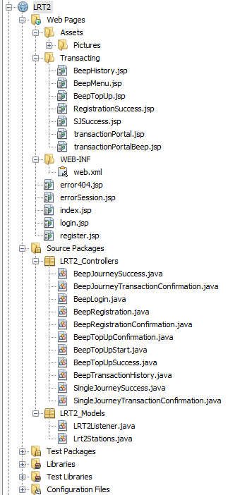

Sample pictures of the runtime of the web application.

## Welcome Page

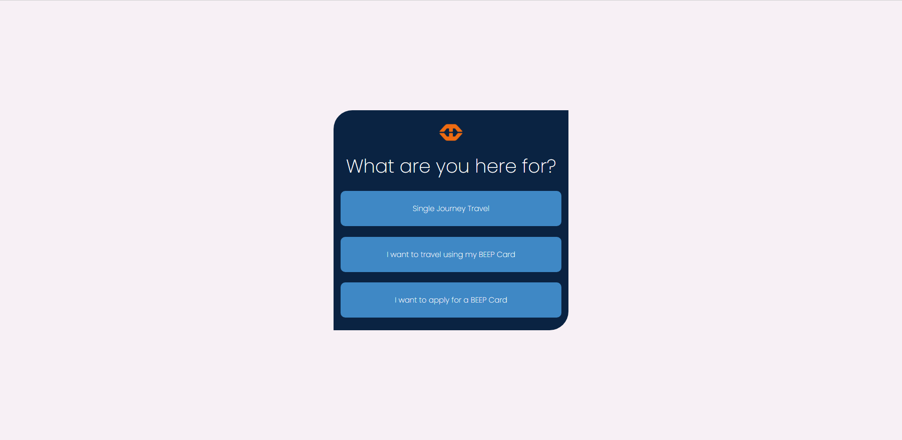

## Travel Page

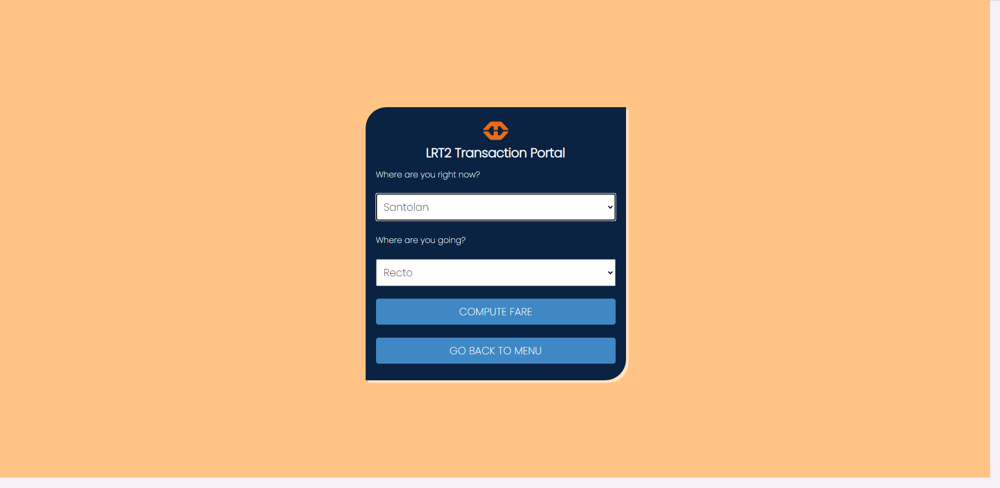

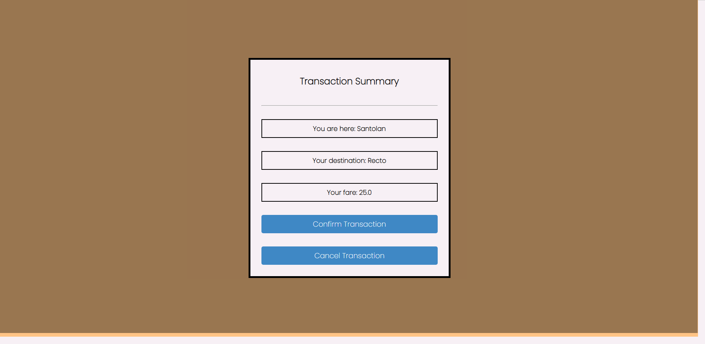

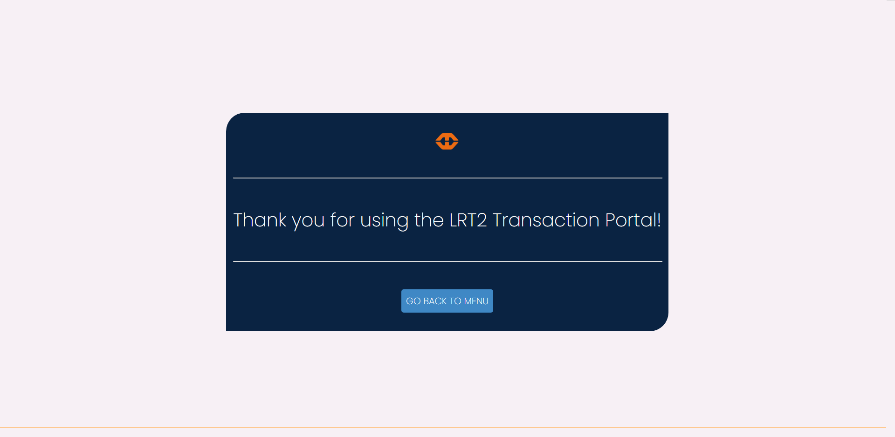

## Register Beep

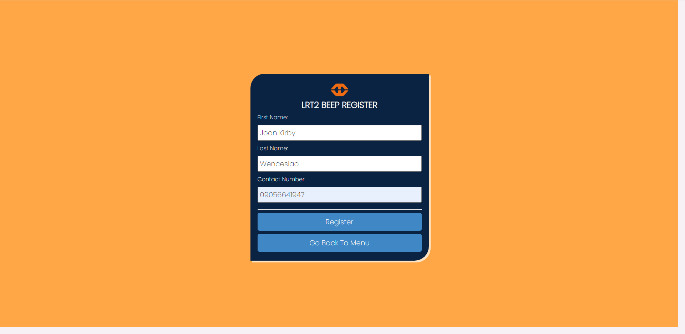

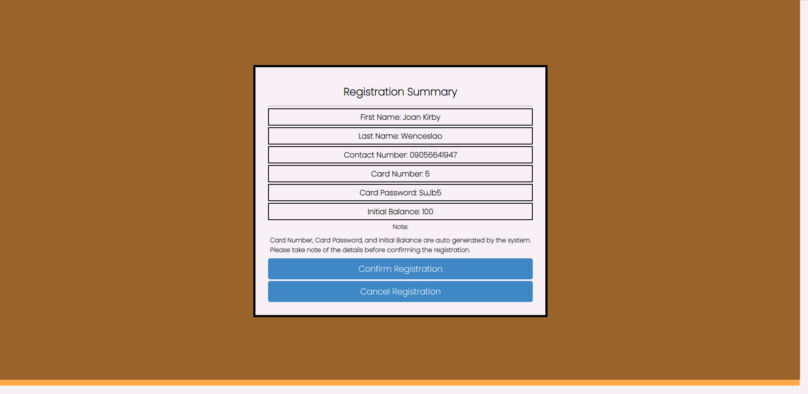

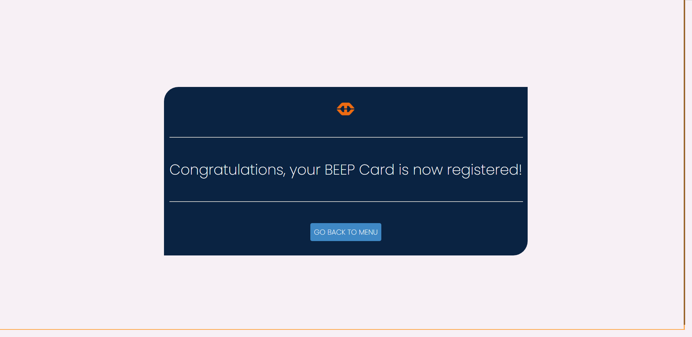

## Beep Profile Pages

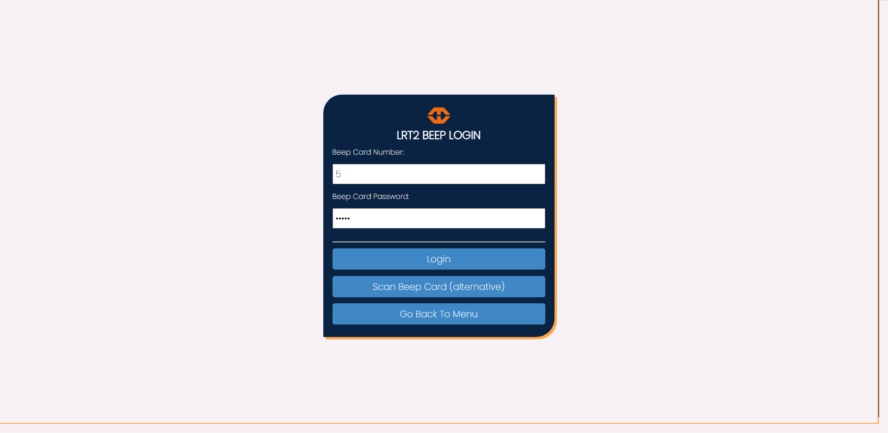

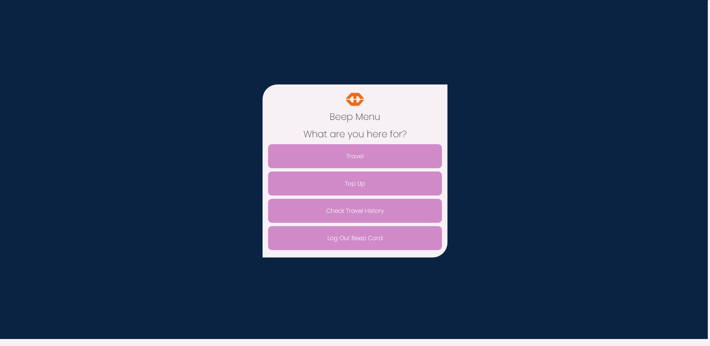

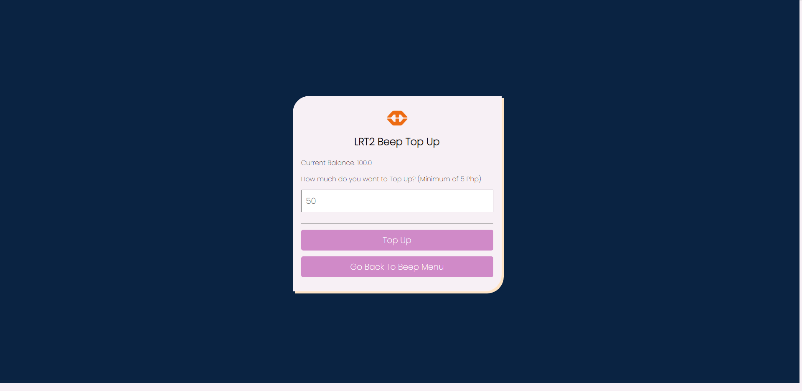

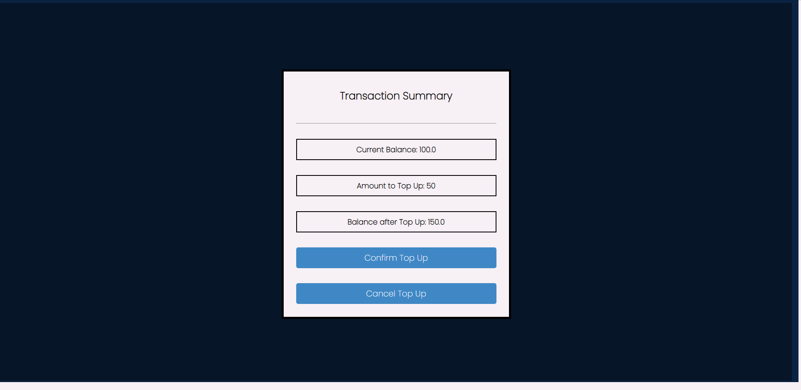

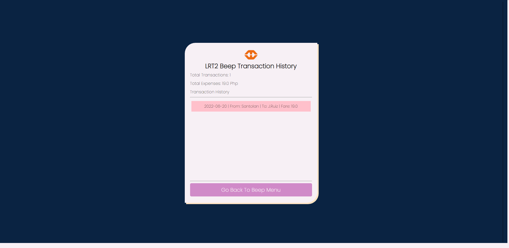

Note: To access the code, you may switch to the master branch as I was still inexperienced with github when I created this repository

